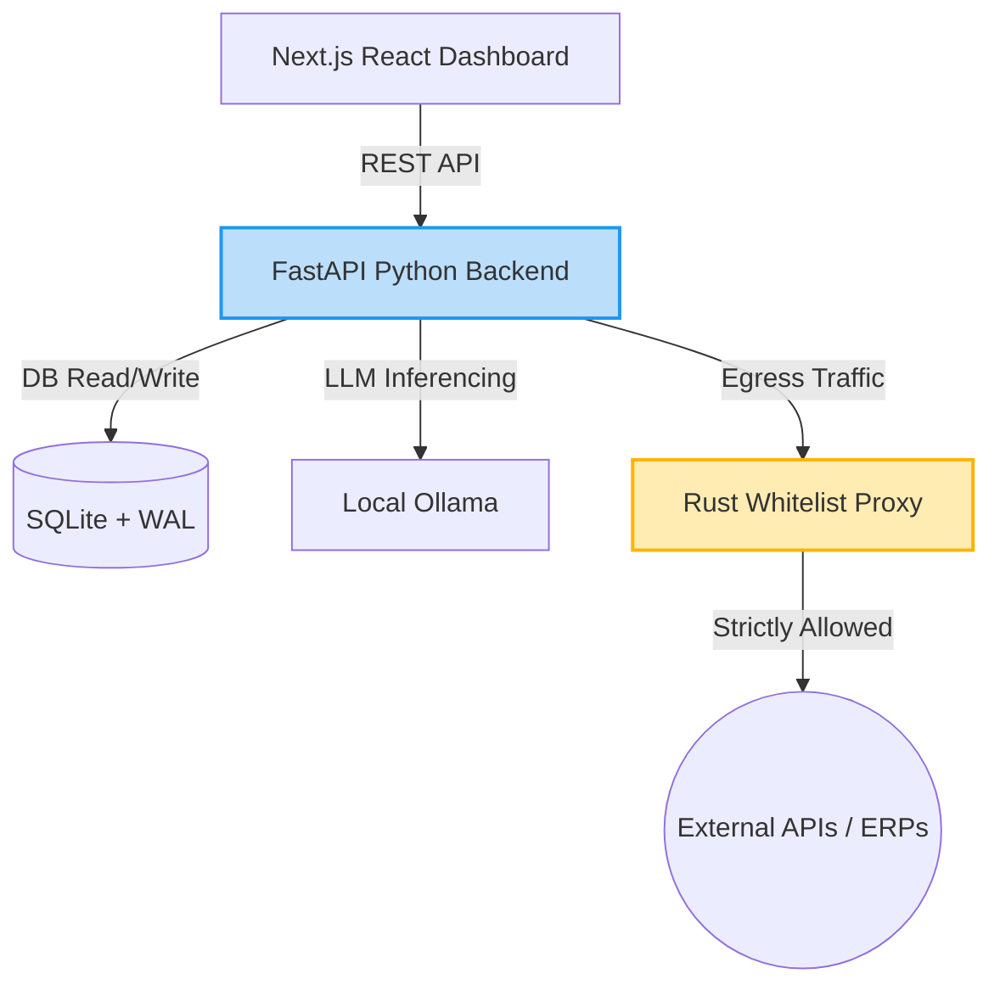

<h1 align="center">
  
  <br />
  Atrosha Sovereign Stack
</h1>

<p align="center">
  <strong>The open-source framework for building Zero-Exfiltration AI Agents.</strong><br>
  Run advanced LLM workflows, financial operations, and complex multi-agent reasoning—completely isolated on your own hardware. 
</p>

<p align="center">
  <a href="#quick-start">Quick Start</a> •
  <a href="#architecture">Architecture</a> •
  <a href="#features">Features</a> •
  <a href="#security-model">Security</a> •
  <a href="#contributing">Contributing</a>
</p>

---

## Why Atrosha?
Cloud APIs are fundamentally incompatible with highly sensitive data. Cap tables, payroll drafts, stealth hardware specs, and healthcare PHI should not be streamed to third-party endpoints. 

**Atrosha** is the first enterprise-grade framework designed exclusively for **local-first, fully sovereign AI**. It provides the robust guardrails, cryptographic audit logs, and network isolation required by CISOs, without sacrificing the power of autonomous agentic workflows.

## Features
- 🛡️ **Rust Egress Proxy**: A kernel-level network proxy that physically blocks the agent from communicating with the outside world, enforcing strict zero-trust whitelisting.
- 🔗 **Cryptographic Audit Chain**: Every decision the agent makes is irreversibly hashed into a local SQLite database using an immutable hash-chain, allowing external auditors to verify data integrity mathematically.
- 🧠 **Bring Your Own Local Model (BYOLM)**: Designed to run alongside local models (Llama 3, Mistral) via Ollama, or fallback to simple regex engines when latency matters.
- 🏢 **Enterprise IAM**: Out-of-the-box Multi-Entity support, Role-Based Access Control (Admin, Approver, Auditor), and SAML/SSO architecture.
- 💸 **Pluggable 'Brain' via Modules**: Pre-built use cases include Anomaly Detection (Z-Score analysis for payroll spikes) and Local OCR Receipt Matching. 

## Architecture
The Atrosha stack is split into three core, independent components:



1. **The Sovereignty Proxy (`/proxy`)**: Written in Rust (`tokio`/`axum`). Acts as a mandatory egress gateway for the Python agent. If the agent tries to send data to an unauthorized endpoint, the Rust proxy kills the request.
2. **The Sovereign Agent (`/sovereign_agent`)**: Written in Python (`FastAPI`). Houses the business logic, the SQLite state database, local OCR, and interacts with local models for spatial reasoning and data extraction.
3. **The Executive Dashboard (`/dashboard`)**: Written in TypeScript (`Next.js`/`Tailwind`). Provides a premium, unified view for human-in-the-loop approvals, anomaly investigation, and audit logging.

## Quick Start

### Prerequisites
- Node.js > 18
- Python > 3.10
- Rust & Cargo
- *Optional:* Ollama (for local LLM Fallback)

### 1. Spin up the Database & Backend
```bash
cd sovereign_agent
python -m venv venv
source venv/bin/activate
pip install -r requirements.txt
python server.py
```
*The FastAPI server will boot on `http://localhost:8003`.*

### 2. Boot the Rust Security Proxy
```bash
cd proxy
cargo run --release
```
*The Rust egress kernel will boot on `http://localhost:8004`.*

### 3. Launch the Executive Dashboard
```bash
cd dashboard
npm install
npm run dev
```
*Access the dashboard at `http://localhost:3000`.*

## Security Model: The "Desert Fortress"
We assume the AI model is inherently untrustworthy and capable of hallucinating data exfiltration vectors. Therefore:
1. **Network Denial-by-Default:** The agent container has no raw internet access. It must route through the Rust proxy.
2. **Local Durability:** State is managed via a SQLite WAL database instead of a cloud instance.
3. **Mathematical Proof of Work:** We compute `SHA-256(previous_hash + timestamp + event + detail)` for every agent action. Any tampering of the database breaks the chain, immediately alerting the `AUDITOR` role.

## Contributing
We welcome contributions from paranoid engineers, cryptography nerds, and local-AI enthusiasts. 
Please see [`CONTRIBUTING.md`](CONTRIBUTING.md) for our strict coding guidelines and PR review process.

## License
MIT License. See `LICENSE` for more information.

---
*Built with ❤️ by a human.*
