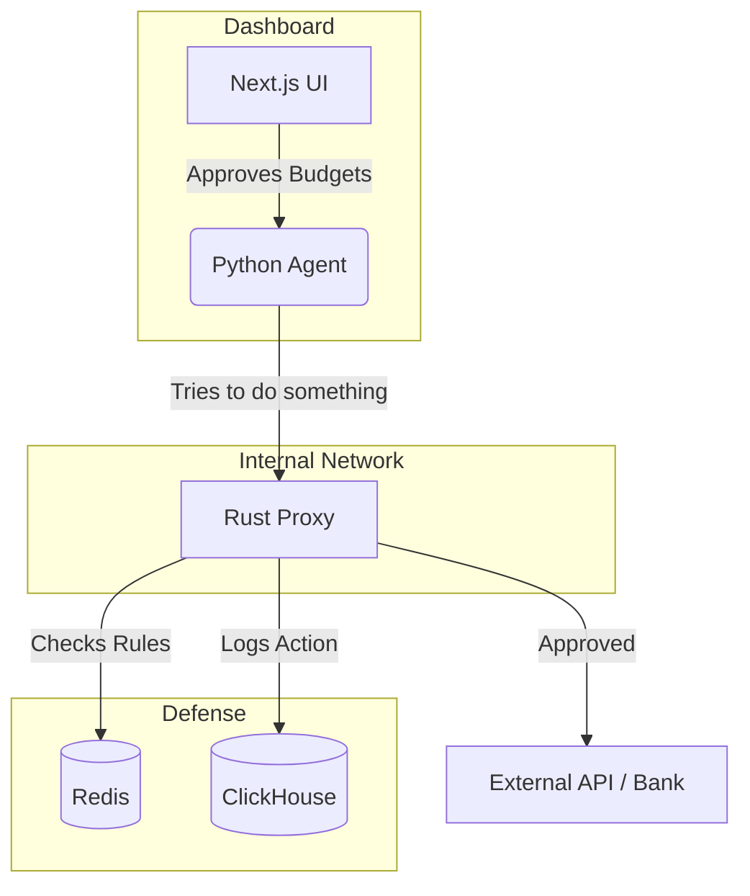

<div align="center">
  <h1>Project Atrosha</h1>
  <p>
    <strong>A local AI agent setup with a built-in Rust proxy for security.</strong>
  </p>

  <p>
    <a href="https://github.com/atrosha/sovereignstack/actions"></a>
    <a href="https://github.com/atrosha/sovereignstack/blob/main/LICENSE"></a>
    <a href="https://rustup.rs/"></a>
    <a href="https://www.python.org/downloads/"></a>
  </p>
</div>

---

## Overview

Project Atrosha is a framework for running AI financial agents locally on your own hardware or VPC.

Most tools send your financial data to external APIs, which can be a security risk. This project keeps everything inside your network. We use a Python backend for the AI logic (like reading invoices or finding weird payroll spikes) and a Rust proxy that sits in front of it. The proxy makes sure the AI agent isn't allowed to make unauthorized API calls or spend more money than it's supposed to. 

If the agent goes off the rails or hallucinates, the Rust proxy blocks the request.

## Architecture

There are three main parts to the stack:

1. **Python Agent**: The actual AI logic. It handles the OCR, talks to your local database, and figures out what APIs to call.
2. **Rust Proxy**: A secure middleman. Every time the agent tries to talk to the outside world, it has to go through here. The proxy checks if the agent is allowed to do that and enforces budget limits.
3. **Next.js Dashboard**: A simple UI where humans can approve budgets, set rules, and see what the agent has been up to.



## Running it locally

You'll need Rust, Python 3.10+, Node, Redis, and ClickHouse to run this locally.

Clone the repo:
```bash
git clone https://github.com/kash002001/atrosha.git
cd atrosha
```

Start Redis and ClickHouse (a docker-compose file is included):
```bash
docker-compose up -d redis clickhouse
```

**1. Start the Rust Proxy**
```bash
cd proxy
cp .env.example .env
cargo run --release
```

**2. Start the Python Agent**
```bash
cd ../sovereign_agent
python -m venv venv
# windows: venv\Scripts\activate, mac/linux: source venv/bin/activate
pip install -r requirements.txt
export PROXY_URL="http://127.0.0.1:8080"
python server.py
```

**3. Start the Dashboard**
```bash
cd ../dashboard
npm install
npm run dev
```

## How to use it

Before the agent can do anything that costs money (like paying a vendor), a human has to approve a budget via the dashboard. 

You can also do it via the API. Here is an example using cURL to give an agent a $500 limit:
```bash
curl -X POST http://localhost:8000/auth/permit \
  -H "X-Atrosha-Entity-ID: org-123" \
  -H "X-Atrosha-Role: ADMIN" \
  -d '{"agent_id": "agent-007", "budget": 500, "intent": "Pay vendor"}'
```

If the agent tries to spend $501, or calls an API that isn't on its allowed list, the Rust proxy will just drop the request. There's also payroll anomaly detection built-in that will automatically flag things if salaries spike weirdly compared to previous months.

## Contributing

Pull requests are welcome. Make sure your Rust code passes `cargo check` and `cargo clippy` without warnings, and run `npm run lint` on the dashboard code before submitting. 

## License

MIT
