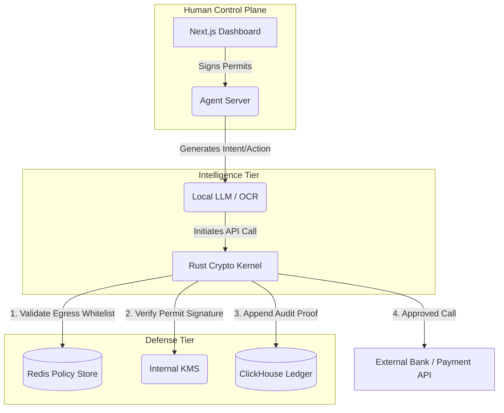

<div align="center">
  <h1>Atrosha</h1>
  <p>
    <strong>The Mathematically Secure, Zero-Exfiltration Financial AI Agent Framework.</strong>
  </p>

  <p>
    <a href="https://github.com/atrosha/sovereignstack/actions"></a>
    <a href="https://github.com/atrosha/sovereignstack/blob/main/LICENSE"></a>
    <a href="https://rustup.rs/"></a>
    <a href="https://www.python.org/downloads/"></a>
  </p>

  <p>
    <a href="#overview">Overview</a> •
    <a href="#architecture">Architecture</a> •
    <a href="#installation">Installation</a> •
    <a href="#quickstart">Quickstart</a> •
    <a href="#usage">Usage</a> •
    <a href="#contributing">Contributing</a>
  </p>
</div>

---

## 🛡️ Overview

**SovereignStack** (codenamed Project Atrosha) is an enterprise-grade framework designed to build, deploy, and monitor **Zero-Exfiltration AI Financial Agents**. 

Unlike SaaS accounting tools that ingest your proprietary financial data into external cloud models, SovereignStack runs entirely on your infrastructure. It combines a state-of-the-art Python intelligence tier with a hardened Rust cryptographic kernel to guarantee that **no data leaves your network without explicit intent verification**.

It is built for CFOs, CISOs, and engineering teams that require maximum security, multi-tenant RBAC (Role-Based Access Control), and verifiable audit chains for autonomous financial operations (AP automation, anomaly detection, payroll drift analysis, etc.).

### Why SovereignStack?

- **Zero Data Exfiltration:** Your data never leaves your VPC. Agents run locally.
- **Cryptographic Guardrails:** The Rust proxy acts as an immutable firewall. If an agent hallucinates a transaction that exceeds its cryptographic budget permit or policy, the transaction is killed at the network edge.
- **Verifiable Audit Chains:** Every action is hashed into a SQLite/ClickHouse ledger forming a cryptographically verifiable chain of events.
- **Multi-Tenant Ready:** Native support for multiple entities, organizations, and strict RBAC architectures.

---

## 🏗️ Architecture

SovereignStack is composed of three tightly coupled components:

1. **The Sovereign Agent (Python / FastAPI)**
   - The intelligence layer. Handles OCR, semantic reasoning, anomaly detection, and database interactions.
2. **The Cryptographic Kernel (Rust / Axum)**
   - The proxy layer. Intercepts all outgoing traffic from the agent. Validates JSON Web Token (JWT) spend permits, intent hashes, egress whitelists, and budget policies.
3. **The Executive Dashboard (TypeScript / Next.js)**
   - The control plane. Allows human operators (CFOs/Approvers) to manage budgets, configure semantic firewalls, review anomalies, and visually audit the agent.



---

## 🚀 Installation

### Prerequisites

You will need the following installed on your machine:
- **Rust** (1.74+) -> [Install via rustup](https://rustup.rs/)
- **Python** (3.10+) -> [Install Python](https://www.python.org/)
- **Node.js** (18+) -> [Install via NVM](https://github.com/nvm-sh/nvm)
- **Redis & ClickHouse** (Can be run via Docker)

### 1. Clone the Repository

```bash
git clone https://github.com/atrosha/sovereignstack.git
cd sovereignstack
```

### 2. Infrastructure (Redis / ClickHouse)
We provide a `docker-compose.yml` (if available) for easy local setup:
```bash
docker-compose up -d redis clickhouse
```

*(Alternatively, ensure Redis is running on `127.0.0.1:6379` and ClickHouse on `127.0.0.1:8123`)*

### 3. Build & Run the Rust Kernel (Proxy)

The cryptographic kernel acts as the gateway. It must be running for the agent to execute any external actions.

```bash
cd proxy
cp .env.example .env  # Configure your secret keys here
cargo build --release
RUST_LOG=info cargo run --release
```
*The proxy will start on `127.0.0.1:8080`.*

### 4. Setup the Python Sovereign Agent

The intelligence layer manages the brain, database, and background loops.

```bash
cd sovereign_agent
python -m venv venv
source venv/bin/activate  # Or `venv\Scripts\activate` on Windows
pip install -r requirements.txt
export PROXY_URL="http://127.0.0.1:8080"
python server.py
```
*The FastAPI server will start on `127.0.0.1:8000`.*

### 5. Start the Executive Dashboard

The Next.js frontend provides the human interface.

```bash
cd dashboard
npm install
npm run dev
```
*The dashboard will be available at [http://localhost:3000](http://localhost:3000).*

---

## 💻 Quickstart & Usage

### 1. Authorizing an Agent
Before an AI agent can execute a transaction (e.g., paying an invoice), a human operator with the `ADMIN` or `APPROVER` role must sign a **Spend Permit**.

You can do this via the Dashboard, or via the management CLI:
```bash
# Example: Issuing a $500 budget permit to "agent-007"
curl -X POST http://localhost:8000/auth/permit \
  -H "X-Atrosha-Entity-ID: org-123" \
  -H "X-Atrosha-Role: ADMIN" \
  -d '{"agent_id": "agent-007", "budget": 500, "intent": "Pay AWS Invoice"}'
```

### 2. The Semantic Firewall
If an agent attempts to hit an endpoint that is not explicitly whitelisted, or attempts to spend `$501` when its permit is `$500`, the Rust Kernel kills the request instantly:

```bash
[WARN] atrosha_proxy::permit: intent hash mismatch - req tampering detected
[ERROR] atrosha_proxy::handlers: transaction blocked by policy engine: BudgetExceeded
```

### 3. Payroll Anomaly Detection
SovereignStack ships with deterministic mathematical anomaly detection out-of-the-box. Drop a payroll CSV into the `sovereign_agent/` processor, and it will calculate Z-Scores against historical norms to automatically pause suspicious salary spikes.

---

## 📂 Repository Structure

```text
sovereignstack/
├── proxy/                   # Rust: The Cryptographic Kernel
│   ├── src/                 # Policy engine, JWT validation, Egress whitelisting
│   └── Cargo.toml           
├── sovereign_agent/         # Python: The Intelligence Layer
│   ├── server.py            # FastAPI entry point
│   ├── brain.py             # Agent reasoning loop
│   ├── db.py                # Verifiable SQLite audit trails
│   └── payroll_engine.py    # Math-based discrepancy detection
├── dashboard/               # TypeScript: The Executive Control Plane
│   ├── src/app/             # Next.js 13+ App Router
│   └── package.json
└── README.md
```

---

## 🤝 Contributing

We welcome contributions from the community! Whether you're fixing a bug, adding a new ML classifier to the agent, or optimizing the Rust proxy, your help is appreciated.

1. Fork the Project
2. Create your Feature Branch (`git checkout -b feature/AmazingFeature`)
3. Commit your Changes (`git commit -m 'Add some AmazingFeature'`)
4. Verify tests and static analysis (`cargo check` & `npm run lint`)
5. Push to the Branch (`git push origin feature/AmazingFeature`)
6. Open a Pull Request

Please refer to `CONTRIBUTING.md` (coming soon) for detailed styling and architecture guidelines. All PRs must maintain our strict **"Zero Warnings"** compile policy.

---

## 📜 License

Distributed under the MIT License. See `LICENSE` for more information.

---

<div align="center">
  <b>Built for sovereignty. Governed by math.</b>
</div>
